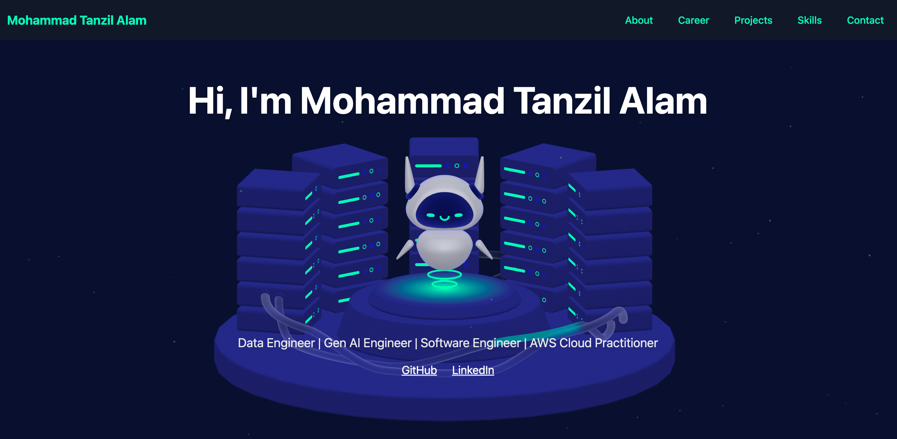

# 💫 Mohammad Tanzil Alam | Portfolio Website

Welcome to my interactive portfolio — a sleek, responsive, and immersive experience built using **React**, **Tailwind CSS**, and **3D Spline**.

🔗 **Live Demo**: 
📬 **Contact**: mohammadtanzilalam@gmail.com  
🔗 **LinkedIn**: [linkedin.com/Tanzil](https://www.linkedin.com/in/mohammad-tanzil-alam/)  
💻 **GitHub**: [github.com/Tanzil](https://github.com/tanzilalam23)  

## 🛠️ Built With

- ⚛️ **React** – Component-based UI
- 💨 **Tailwind CSS** – Utility-first CSS framework
- 🎯 **Vite** – Blazing-fast build tool
- 📱 **Fully Responsive** – Optimized for all screens
- 🧊 **Glassmorphism & 3D Effects** – Polished UI/UX

---

## 🚀 Features

- 🌌 3D Spline integration in the hero section
- 🧱 Project tiles with **glassmorphic + flip** animations
- 📄 Scroll-to-top button for improved navigation
- 💬 Contact form powered by **Formspree**
- 🎨 Clean code, modular React components, reusable styles

---

## 🧪 Screenshots

### 🌠 Hero Section (Interactive Spline)

## 🙌 Credits

* 🎨 UI Framework: [Tailwind CSS](https://tailwindcss.com/)
* 🧠 Icons: [Heroicons](https://heroicons.com/)
* 🌌 3D Model: [Spline](https://spline.design/)

---

## 📌 License

This project is open-source and free to use for learning and personal portfolios. Commercial redistribution is not permitted.

---
